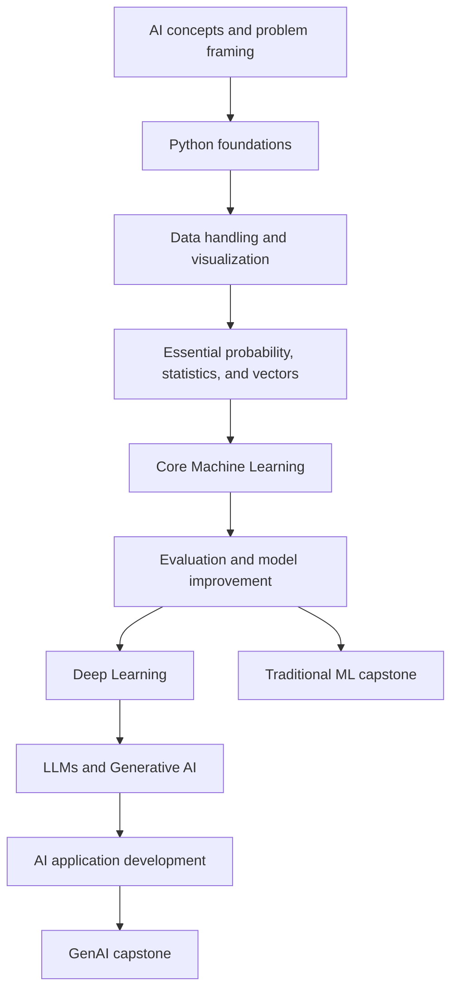

# Course Framework

## 1. As-is reference framework

The repository intelligence report describes `Courses-And-FrameWorks` as a GitHub-centered learning-program and assessment framework, rather than a conventional LMS. The common pattern is:

**Program specification → topics/resources → task or activity → learner workspace → branch/PR or activity record → human review → progress update.**

Useful patterns to preserve:
- Program specifications define scope, topics, tools, outcomes, and resources.
- Coding programs often use ten progressively more integrated assessment tasks.
- GitHub branches and pull requests create reviewable evidence of work.
- Markdown is the main documentation format.
- Member workspaces and progress records provide a lightweight portfolio ledger.

Gaps identified in the report that this course addresses:
- A meaningful top-level onboarding guide.
- Clear prerequisites and learning paths.
- Consistent resource mapping.
- Explicit rubrics and completion rules.
- A distinction between resource opened, exercise submitted, and competency demonstrated.
- A consistent canonical curriculum separate from learner evidence.

These are findings from the supplied report, not claims that the original repository has been modified.

## 2. Proposed AI/ML framework

### Learning loop

1. **Learn** — use the mapped article, video, or documentation.
2. **Understand** — explain the idea in plain language and identify assumptions.
3. **Visualize** — draw a diagram, table, or flow of the concept.
4. **Experiment** — change one variable or input and observe the result.
5. **Build** — complete a task without blindly copying a tutorial.
6. **Explain** — document what worked, what failed, and why.
7. **Submit & review** — create a branch/PR or submit work to the mentor.
8. **Demonstrate mastery** — satisfy the rubric and correct requested changes.

### Course design rules

- Start with intuition and examples before formal notation.
- Introduce Python and mathematics only as needed, but do not skip them.
- Every resource should map to a module and learning objective.
- Use original exercises; do not reproduce full third-party articles or videos.
- Label a resource as primary, supplementary, or pending review.
- Never mark mastery based only on attendance or video completion.
- Include limitations, data quality, privacy, bias, and evaluation in project work.
- Advanced modules are optional until prerequisites and resource coverage are adequate.

## 3. Proposed prerequisite map

The sequence is a proposed learning design. The supplied resources explicitly cover AI/ML introductions and ML topics; the deeper branches need additional resource selection.

## 4. Module definition

Each module must include:
- Scope and measurable outcomes.
- Prerequisites.
- Ordered lessons and mapped resources.
- Exercises and one assessed deliverable.
- Rubric and completion checklist.
- Next-step recommendation.
- Known resource or coverage gaps.

## 5. Assessment approach

Suggested common rubric (100 points):
- Conceptual understanding: 20
- Practical implementation: 30
- Correctness and testing: 20
- Code quality and documentation: 15
- Explanation, reflection, and review response: 15

Suggested completion policy:
- Score at least 70/100.
- No critical correctness or data-leakage issue in the submitted practical work.
- Explain the approach and at least one limitation.
- Address required review changes before marking approved.

These are new proposals and can be adjusted by the team.
